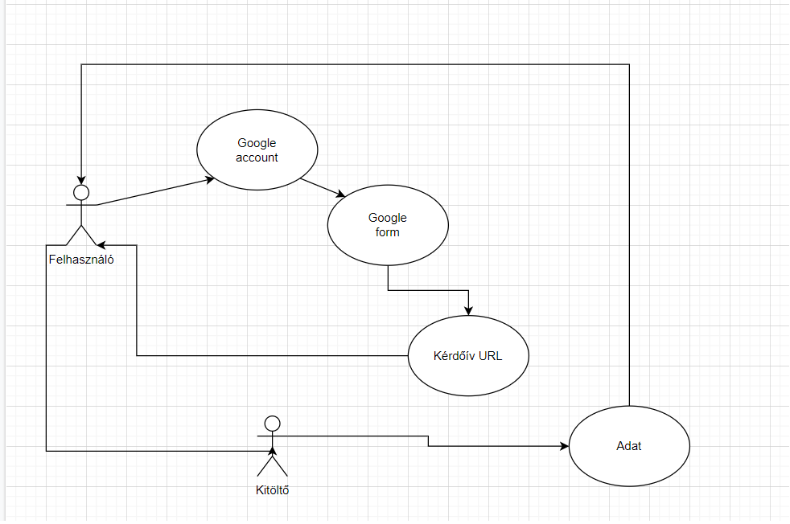
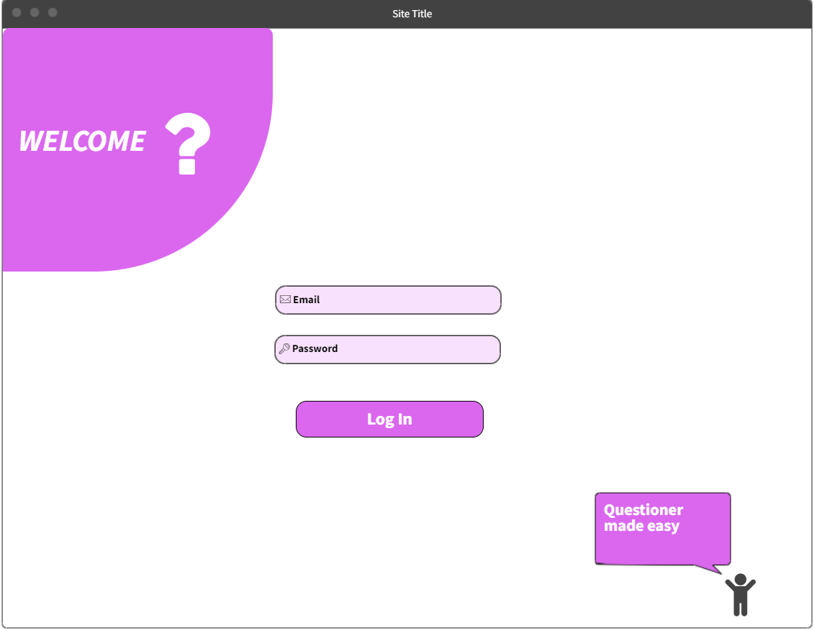
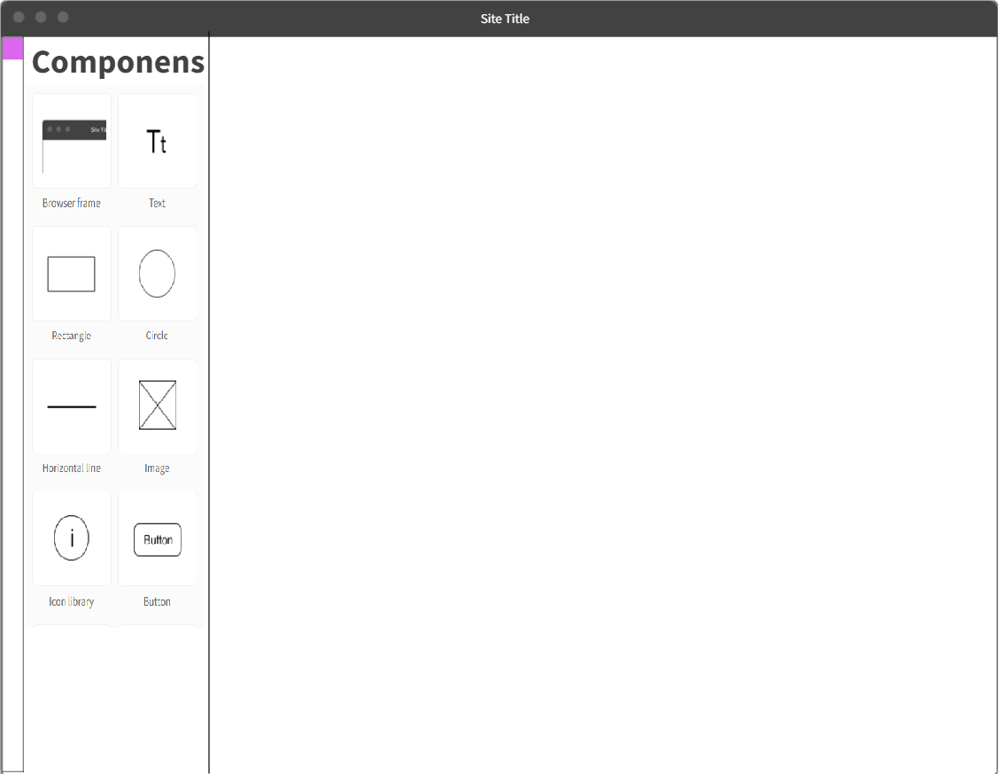

## Funkcionális specifikáció

## Rendszer céljai és nem céljai
A rendszer célja egy felhasználóbarát kérdőív létrehozó webalkalmazás.
    - Emberek regisztálhatnak
    - Bejelentkezhetnek
    - Készíthetnek kérdőíveket
    - Kitölthetnek kérdőíveket
    - Megnézhetik az általuk létrehozott kérdőív kitöltési statisztikáit
A rendszerünknek nem célja a Google Forms leváltása.
## Jelenlegi helyzet leírása
Jelenleg több rendszer is létezik kérdőívek generálására, ezek közül a legismertebb
A Google Form, ahol saját magunknak készíthetünk kérdőíveket, majd ezeket
megoszthatjuk más felhasználókkal. A Google Form nem támogatja megfelelően a statisztikák
megjelenítését. Emellett az itt elkészült statisztikákat nem tudjuk megosztani, esetleg
behivatkozni, ha valaki például szakdolgozathoz szeretné felhasználni az adatokat.
Emellett nincs lehetőség interaktív, akár százalékos válaszok megadására, a kérdőívet
tervező felhasználó lehetőségei korlátozottak. 
Idősebb felhasználók számára bonyolult a mostani rendszer, többen preferálják a
drag'n'drop módszert.
Emellett a jelenlegi módszer a Google tulajdona, kitöltéséhez Google által üzemltetett
Gmail fiók szükséges, amelyet nem minden felhasználó preferál.

## Vágyálom rendszer leírása
A megrendelő szeretne egy olyan kérdőív létrehozó oldalt, mely egyszerűen kezelhető.
Elképzelései a következők:
    - Felhasználók tudnak regisztrálni az oldalra, létrehozhatnak kérdőíveket, melyeket másokkal megoszthatnak,
és mások akár regisztráció nélkül is kitölthetik.
    - Az adott kérdőívet létrehozó felhasználó valós időben nyomon követheti a kitöltési statisztikákat.
    - Az oldal kezelése felhasználóbarát.
    - A kérdőíveket könnyű létrehozni, és kitölteni is.
    - Több válaszadási lehetőség (igen - nem, 1-10, saját szöveg stb.)
## Rendszerre vonatkozó külső megszorítások
A rendszerbe való belépéshez e-mail címre és jelszóra lesz szüksége a felhasználónak,
ezért ezek megfelelő tárolására, kezelésére vonatkozó GDPR szabályozását kell követnünk
emellett a jelszavak tárolására ajánlott az úgynevezett Hash-elt verzió tárolása.
A felhasználó által megadott válaszokat bizalmasan kezeljük, a kérdőívet létrehozó
felhasználó számára sem jeleníthetjük meg, hogy mely felhasználó milyen kérdésekre
milyen választ adott, így a kérdőívek teljesen anonimak maradhatnak.
Emellett gondoskodnunk kell az adatok és az érintett kapcsolatának helyreállíthatatlanságáról.
A rendszerre vonatkozik az adatbázisokra alkalmazott Harmadik Normálforma által meghatározott
tervezési módszer is. Továbbá a felhaszálói felületet köti, a User Interface-k tervezését
megkönnyítő, felhasználó számára olvashatóbbá tevő javaslatok összessége is.

## Jelenlegi üzleti folyamat modellje

Jelenleg elősször is a felhasználónak regisztrálni kell egy google fiókot,
ha google forms kérdőívet szeretne létrehozni,
és egyes esetekben a kitöltőnek is rendelkeznie kell egy fiókkal.
Ez az idősek számára már bonyolult lehet.
A létrehozó elküldi az URL-t a kitöltőnek.
A kitöltő megnyitja a kapott URL-t és a saját véleménye szerint kitölti azt,
majd megnyomja a beküldés gombot.
Ezt követően az adatok bekerülnek az adatbázisba,
majd a A létrehozó a kitöltések után megkapja a válaszokat.

## Igényelt üzleti folyamatok modellje
A megrendelő szeretne egy regisztrációs felületet, ahol e-mail, felhasználónév és jelszó megadásával egy új felhasználót hozhat létre.
A regisztrációs felülettel egybekötött a bejelentkezési felület.
Itt egy már regisztrált felhasználó e-mail, és jelszó megadásával tud bejelentkezni.
Szükség van egy kérdőív létrehozó felületre, ahol az adott felhasználó saját kérdőíveket csinálhat.
A kérdőív mentése után egy URL generálódik, amivel a kitöltők elérhetik és kitölthetik a kérdőívet.
Kitöltés után az adatok megjelennek a kérdőívet létrehozó felhasználó profilján,
a statisztikákkal együtt.
## Követelménylista

|Modul        | ID |Név                    | v.|Kifejtés                              |
|-------------|----|-----------------------|---|--------------------------------------|
| Jogosultság | K1 | Bejelentkezési | 1.0 |A felhasználó az email címe és a jelszava segítségével bejelentkezhet. Ha a megadott e-mail cím vagy jelszó nem megfelelő, hiba üzenetet kap.|
| Jogosultság | k2 | Regisztráció |1.0| A felhasználó e-mail cím és jelszó megadásával regisztrálhat. A jelszó titkosítva és az e-mail cím az adatbázisunkban tárolásra kerül. Ha valamelyik adat ezek közül hiányzik vagy nem megfelelő, arról a felhasználó értesítést kap. |
| Jogosultság | k3 | Létrehozás | 1.0 | A regisztrált felhasználók kérdőíveket hozhatnak létre|
| Felület | k4 | Bejelentkezés | 1.0 | A felhasználók itt tudnak belépni a rendszerbe|
| Felület | k5 | Regisztráció | 1.0 | A felhasználók ezen a felület tudnak regisztrálni. |
| Felület | K6 | Létrehozás | 1.0 |Ezen a felületen tudnak a felhasználók kérdőíveket létrehozni |
| Felület | K7 | Kitöltés | 1.0 | Azok a felhasználók, akik megkapták az URL-t a kérdőívhez, ezen a felületen tudják kitölteni |

## Használati esetek
A szoftvert kiválóan lehet alkalmazni például szakdolgozathoz, felmérésekhez, munkahelyi vagy
iskolai anonim szavazásokhoz.
### Szerepkörök:

- Kérdőív készítő: A kérdőív készítője létrehozhat, módosíthat vagy törölhet kérdőíveket, 
megtekintheti azok eredményeit, statisztikai adatokat, mint például átlagot, móduszt, 
mediánt, vagy diagramokat kérhet le és tekinthet meg. Az így kapott adatokat megoszthatja
más felhasználókkal és nem felhasználókkal link vagy lementett kép formájában, és 
behivatkozhatja azokat. A kérdőív készítő nem szerkesztheti mások kérdőíveit, 
de kitöltői szinten kitöltheti azokat. A kérdőív készítője kitöltheti a saját kérdőívét is.
- Kitöltő: A kérdőív kitöltőnek nem kötelező regisztrálnia az alkalmazásba, enélkül is 
szabadon kitölthet kérdőíveket. A kitöltő a kérdőívekhez valamilyen meghívás útján csatlakozhat,
azokat módosítani, törölni nem tudja és eredményeiket sem láthatja a kérdőív készítő hozzájárulása
nélkül.

## Képernyőtervek

## Követelmény megfeleltetés
    - A bejelentkezési felülettel megvalósul a K1 és K4 követelmény
    - A regisztrációs felülettel megvalósul a K2 és K5 követelmény
    - A felhasználó rendelkezik kérdőív létrehozó jogosultsággal (K3)
    - A létrehozást egy felületen történik, ezzel megvalósul a K6 követelmény
    - A kitöltéshez is egy külön felület tartozik (K7)
