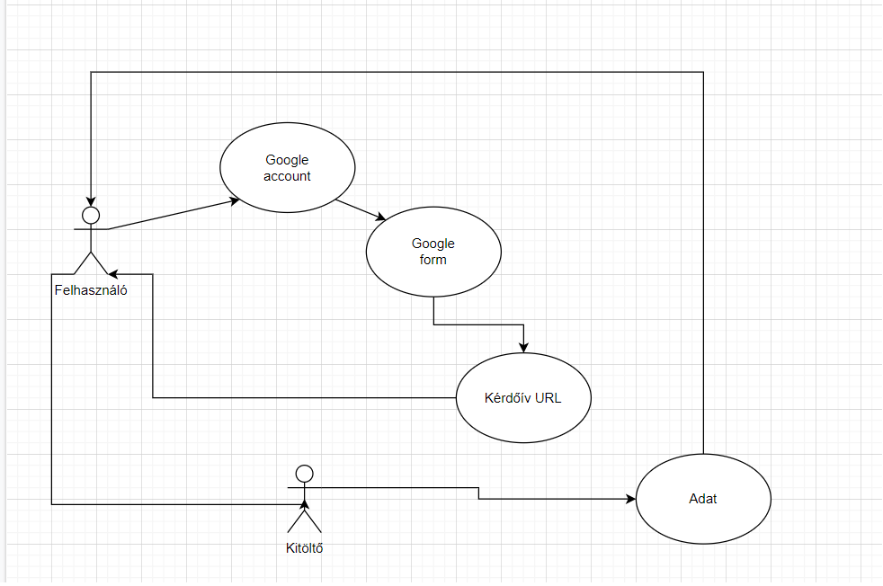

# Követelményspecifikáció

## Jelenlegi helyzet leírása

## Vágyálom rendszer leírása

## Rendszerre vonatkozó törvények, rendeletek, szabványok, ajánlások

## Jelenlegi üzleti folyamat modellje

Jelenleg elősször is a felhasználónak regisztrálni kell egy google fiókot,
ha google forms kérdőívet szeretne létrehozni,
és egyes esetekben a kitöltőnek is rendelkeznie kell egy fiókkal.
A létrehozó elküldi az URL-t a kitöltőnek.
A létrehozó a kitöltések után megkapja a válaszokat.

## Igényelt üzleti folyamatok modellje

## Követelménylista
