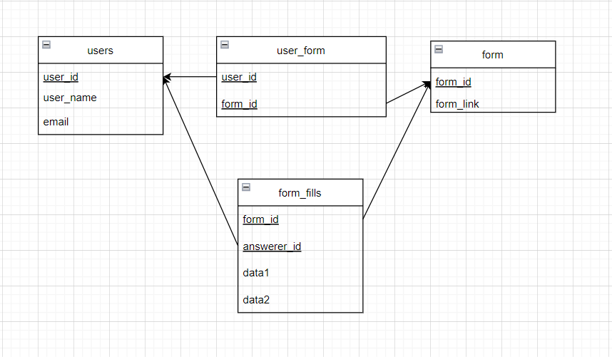

## Rendszerterv

## A rendszer célja
A rendszer célja egy felhasználóbarát kérdőív létrehozó webalkalmazás.
    - Emberek regisztálhatnak
    - Bejelentkezhetnek
    - Készíthetnek kérdőíveket
    - Kitölthetnek kérdőíveket
    - Megnézhetik az általuk létrehozott kérdőív kitöltési statisztikáit
A rendszerünknek nem célja a Google Forms leváltása.
## Üzleti folyamatok modellje

## Követelmények
- Felhasználóbarát környezet létrehozása kérdőívek készítéséhez
- Felhasználók kérdőíveinek eltárolása adatbázisban
- A kérdőívek statisztikáinak eltárolása adatbázisban, hozzáférhetővé tétele a készítő számára
- A statisztikák valós időben történő naprakésszé tétele
- Webes környezetben való működés
- GDPR-nak való megfelelés, jelszavak titkosított tárolása
- A kérdőívek kitöltésének biztosítása, regisztráció nélkül
## Funkcionális terv
- Szerepkörök:
    - Admin
    - Felhasználó 
    - Kitöltő
- KITÖLTŐ:
    - Tud kérdőíveket kitölteni, és azokat beküldeni
    - Ezzel a szerepkörrel rendelkezik mindenki, aki nem regisztrál
- FELHASZNÁLÓ:
    - Ezzel a szerepkörrel rendelkezik az, aki regisztrál
    - Tud kérdőíveket létrehozni
    - Tud kérdőíveket kitölteni
    - Hozzáfér az általa létrehozott kérdőív statisztikáihoz
    - Tudja törölni az általa létrehozott kérdőívet
- ADMIN:
    - Rendelkezik minden felhasználói joggal
    - Tud felhasználót törölni
## Fizikai környezet

## Architekturális terv

## Adatbázis terv
Az adatbázisban minden form-nak külön, megfelelő adatbázis hátteret kell biztonsítanunk.
Ennek oka, hogy a különböző form-ok különböző mennyiségú és bemenetű válaszokat (számot, szöveget vagy eldöntendő választ)
várnak, ezért nem lehetséges egyetlen sémára létrehozni őket.
Erre főként az elkövetkező statisztikák megfelelő kiértékelése végett van szükség.

## Implementációs terv

## Tesztterv

## Telepítési terv
A szoftver egy webszerveren fog működni, így a webes felületéhez csak egy böngészőre van szükség.
Külön szoftvert nem kell telepíteni.
A webszerverre közvetlenül az internetről kapcsolódnak rá a kliensek.
Mobil és tablet eszközökön is elérhető, kezdetben nem reszponzív formában, de ez a későbbi verziókban változhat.

## Karbantartási terv
