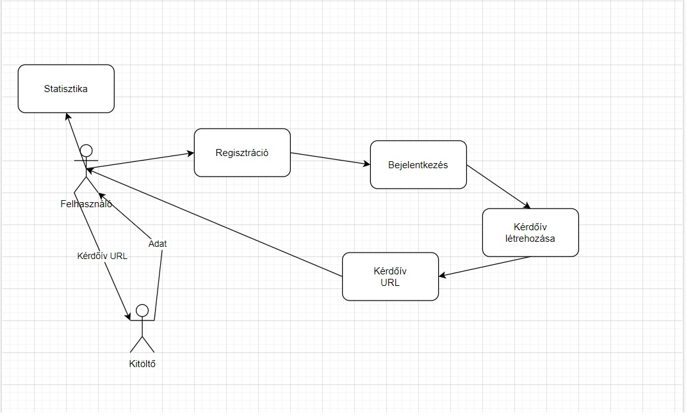

## Rendszerterv

## A rendszer célja
A rendszer célja egy felhasználóbarát kérdőív létrehozó webalkalmazás.
    - Emberek regisztálhatnak
    - Bejelentkezhetnek
    - Készíthetnek kérdőíveket
    - Kitölthetnek kérdőíveket
    - Megnézhetik az általuk létrehozott kérdőív kitöltési statisztikáit
A rendszerünknek nem célja a Google Forms leváltása.
## Üzleti folyamatok modellje
A megrendelő szeretne egy regisztrációs felületet, ahol e-mail, felhasználónév és jelszó megadásával egy új felhasználót hozhat létre.
A regisztrációs felülettel egybekötött a bejelentkezési felület.
Itt egy már regisztrált felhasználó e-mail, és jelszó megadásával tud bejelentkezni.
Szükség van egy kérdőív létrehozó felületre, ahol az adott felhasználó saját kérdőíveket csinálhat.
A kérdőív mentése után egy URL generálódik, amivel a kitöltők elérhetik és kitölthetik a kérdőívet.
Kitöltés után az adatok megjelennek a kérdőívet létrehozó felhasználó profilján,
a statisztikákkal együtt.

## Követelmények
- Felhasználóbarát környezet létrehozása kérdőívek készítéséhez
- Felhasználók kérdőíveinek eltárolása adatbázisban
- A kérdőívek statisztikáinak eltárolása adatbázisban, hozzáférhetővé tétele a készítő számára
- A statisztikák valós időben történő naprakésszé tétele
- Webes környezetben való működés
- GDPR-nak való megfelelés, jelszavak titkosított tárolása
- A kérdőívek kitöltésének biztosítása, regisztráció nélkül
## Funkcionális terv
- Szerepkörök:
    - Admin
    - Felhasználó 
    - Kitöltő
- KITÖLTŐ:
    - Tud kérdőíveket kitölteni, és azokat beküldeni
    - Ezzel a szerepkörrel rendelkezik mindenki, aki nem regisztrál
- FELHASZNÁLÓ:
    - Ezzel a szerepkörrel rendelkezik az, aki regisztrál
    - Tud kérdőíveket létrehozni
    - Tud kérdőíveket kitölteni
    - Hozzáfér az általa létrehozott kérdőív statisztikáihoz
    - Tudja törölni az általa létrehozott kérdőívet
- ADMIN:
    - Rendelkezik minden felhasználói joggal
    - Tud felhasználót törölni
## Fizikai környezet

Az alkalmazás web platformra készül, elérhető lesz hordoható eszközökön is.
Pl: okostelefon, táblagép stb..
Nincsenek megvásárolt komponenseink.
- Fejlessztői eszközök:
    - Visual studio code
    - Springboot
    - SQLDeveloper

## Architekturális terv
Backend: 
A rendszerhez szükség van egy adatbázis szerverre, ebben az esetben
MySql-t használunk. A kliens oldali programokat Springboottal szolgáljuk ki,
ami egy Java alapú keretrendszer.
Ez csatlakozik az adatbázishoz, és ez kommunikál vele.

Web kliens:
A web alkalmazás Springboot keretrendszer segítségével készül el,
a látványért HTML és CSS felel.
A gombok használatát JavaScripttel oldjuk meg,
ez fogja meghívni a backend funkcióit.

## Adatbázis terv
Az adatbázisban minden form-nak külön, megfelelő adatbázis hátteret kell biztonsítanunk.
Ennek oka, hogy a különböző form-ok különböző mennyiségú és bemenetű válaszokat (számot, szöveget vagy eldöntendő választ)
várnak, ezért nem lehetséges egyetlen sémára létrehozni őket.
Erre főként az elkövetkező statisztikák megfelelő kiértékelése végett van szükség.

## Implementációs terv

A Webes felület főként HTML, CSS, és Javascript nyelven fog készülni.
Ezeket igyekszünk külön fileokba írni.
A backendben Springboot-ot és MySQL adatbázist fogunk használni.
A Springboot kommumnikál az adatbázissal, adatot kér vagy küld neki,
a frontend kommunikál a Springboottal, adatot kér vagy küld.

## Tesztterv
A tesztelés célja a rendszer és komponenseinek funkcionalitásának teljes vizsgálata és tesztelése,
az üzleti szolgáltatások verifikálása és a megfelelő felhasználói élmény felderítése.
### Tesztelési eljárások

#### Unit teszt
Fontos a rendszer metódusainak funkcionalitását már a fejlesztési idő alatt tesztelni, 
így ahol csak lehetséges Unit teszteket kell írnunk és minél nagyobb és pontosabb lefedettségben
vizsgálni az általunk előállított kódot. A teszt alatt szükséges szélsőséges, akár a leírásnak
nem megfelelő adatokkal is tesztelnünk így kiküszöbölhetjük a későbbiekben fellépő, misztikusnak
tűnő hibákat.
A metódusokat akkor számíthatjuk késznek ha a rájuk írt Unit tesztek sikeresen, hiba nélkül lefutottak.

#### Alfa teszt
A teszt célja hogy a meglévő funkciókat különböző böngészőkben, felületeken és operációs rendszereken teszteljük. 
A tesztet fejlesztők végzik, akkor számítható a teszt sikeresnek, ha az alkalmazás különböző, a közönség számára
elérhető és gyakran használt operációs rendszereken és böngészőkben megfelelően működik.
A teszt időtartama egy nap.

#### Béta teszt
A tesztet egy előre regisztrált, lehetséges felhasználói csoport végzi, a saját otthoni eszközeiken és erről 
folyamatos visszajelzést küldenek. A felhasználók képességei és az általuk használt eszközök teljesítménye,
típusa és igénybevétele előzetesen egyeztetésre, és beleegyezésük után eltárolásra került. 
A tesztelés alatt a csoport folyamatos visszajelzéseket küld a fejlesztőknek a felmerülő problémákkal,
igényekkel és ötletekkel kapcsolatban. 
A fejlesztők igyekeznek ezeket javítani, implementálni és a kérdéseket minél előbb, érthetően és 
felhasználóbarátan megválaszolni.
A teszt időtartama egy hét, amely a problémák mennyiségétől függően hosszabbodhat
##### Tesztelendő rendszerek:
- Operációs rendszerek: Android, Linux, Mac/IOS, Windows
- Böngészők: Google Chrome, Mozilla Firefox, Safari, Opera, Microsoft Edge

#### Tesztelendő funkciók

##### Backend service
A rendszernek képesnek kell lennie az adatbázis elérésére, annak megfelelő kezelésére, töltésére
szükség esetén módosítására vagy abban való törlésre.
Az adatbázisnak képesnek kell lennie az adatok eltárolására, feldolgozására, azok visszaadására, 
megfelelő lekérdezések kiszolgálására, módosítások vagy törlések feldolgozására, hiba esetén
pedig a megfelelő állapot visszaállítására.
Képesnek kell lennie arra, hogy egyszerre több klienst is kiszolgáljon.
Képesnek kell lennie különböző felületeken a megfelelő és elérhető funkciók biztosítására.

##### Login felület
A felhasználónak képesnek kell lennie a belépésre
A felhasználónak képesnek kell lennie a jelszóemlékeztető megkérésére

##### Regisztrációs felület
A felhasználónak képesnek kell lennie új fiókot létrehozni
A rendszernek képesnek kell lennie detektálni, hogy a felhasználó létrehozott-e már
fiókot hasonló adatokkal
A rendszernek képesnek kell lennie kommunikálni a háttér adatbázissal és abban elmenteni a
felhasználó adatait

##### Kitöltői felület
A felhasználónak képesnek kell lennie az adott form kitöltésére, a form tulajdonosa által
megadott elérések segítéségvel

## Telepítési terv
A szoftver egy webszerveren fog működni, így a webes felületéhez csak egy böngészőre van szükség.
Külön szoftvert nem kell telepíteni.
A webszerverre közvetlenül az internetről kapcsolódnak rá a kliensek.
Mobil és tablet eszközökön is elérhető, kezdetben nem reszponzív formában, de ez a későbbi verziókban változhat.

## Karbantartási terv
Az alkalmazás folyamatos és megfelelő működése érdekében létfontosságúvá válik a megfelelő karbantartás.
Ez magába foglalja a User reportokban dokumentált hibák elhárítását, a felbukkanó és megújuló
felhasználói igények kielégítését és a technológiák fejlődésével felmerülő lehetőségek
beépítése és kiaknázása és minél kreatívabb és felhasználóbarátabb beépítése a programba.
Mivel a program webes felületen fut, így nem szükséges minden kiadott Android és IOS rendszerre
megfigyelnünk a kompatibilitást, de érdemes bizonyos verziónként ellenőriznünk azokat.
Emellett szükséges az alkalmazás mögött futó adatbázis karbantartása, tisztítása és bővítése.
Az adatok megfelelő mentéséről és azok biztonságos tárolásáról is meg kell győződnünk és fenn kell tartanunk.

### Karbantartás
Corrective Maintenance: A felhasználók által felfedezett és "user reportban"
elküldött hibák kijavítása.
Adaptive Maintenance: A program naprakészen tartása és finomhangolása.
Perfective Maintenance: A szoftver hosszútávú használata érdekében végzett
módosítások, új funkciók, a szoftver teljesítményének és működési
megbízhatóságának javítása.
Preventive Maintenance: Olyan problémák elhárítása, amelyek még nem
tűnnek fontosnak, de később komoly problémákat okozhatnak